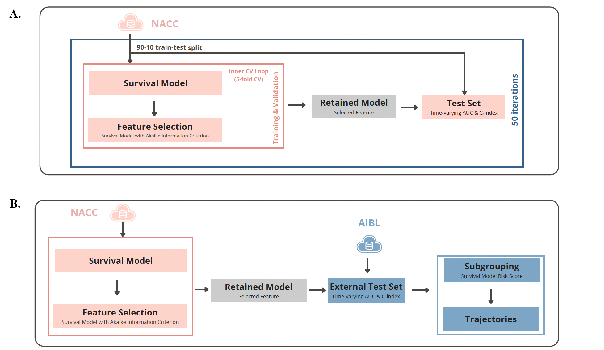
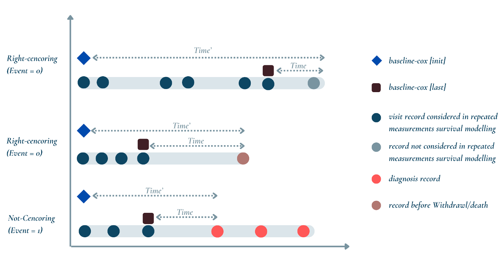

# Prediction for Early and Late-Stage Cognitive Decline Using Repeated Measurements and Time-Dependent Cox Regression

This is the official repository accompanying the paper **Prediction for Early and Late-Stage Cognitive Decline Using Repeated Measurements and Time-Dependent Cox Regression**

**Authors:**

Yihan Wang, Benjamin Goudey, Xinran Cui, Shu Liu, Colin L. Masters, Liang Jin, Yijun Pan

## Overview
We utilized data from 1,973 National Alzheimer's Coordinating Center (NACC) and 942 The Australian Imaging, Biomarkers and Lifestyle (AIBL) study participants to constitute a survival analysis considering repeated measurements to develop the Alzheimer’s Disease Risk Score (ADRS) model. The ADRS model can then predict the risk score and then stratified the particiapnts into high- and low-risk group.

## Machine Learning Model pipeline

## Visualization of the Censoring and Repeated Meausrements

## Acknowledgements
The study received support from National Health and Medical Research Council (Australia) Investigator Grant (GNT2007912), NHMRC-AMED Dementia Collaborative Research Grant (GNT2022203), and Alzheimer’s Association USA (23AARF-1020292).  

## Data Sharing Statement
The data used in this study are derived from the Australian Imaging, Biomarkers, and Lifestyle (AIBL) dataset and the National Alzheimer's Coordinating Center (NACC), which is subject to specific access conditions. Due to these restrictions, we are unable to share the data directly.

## Code Repository Structure
- [code](/code): Contains the code for machine learning model construction and evaluation.
    - [preprocessing-AD](/code/preprocessing(AIBL+NACC)%20simplify.ipynb): scripts for merging and filtering data for CU/MCI-AD survival analysis.
    - [preprocessing-MCI](/code/preprocessing(AIBL+NACC)%20simplify.ipynb): cripts for merging and filtering data, as well as different versions of dataset construction (e.g., baseline-cox[init], baseline-cox[last], aggregate-cox and ADRS) for CU-MCI survival analysis.
    - [model-evaluation-AD](/code/model_performance_AD.Rmd): Code for machine learning model construction and evaluation for different versions of dataset construction (e.g., baseline-cox[init], baseline-cox[last], aggregate-cox and ADRS) for CU/MCI-AD survival analysis.
    - [model-evaluation-MCI](/code/model_performance_MCI.Rmd): Code for machine learning model construction and evaluation fro different versions of dataset construction (e.g., baseline-cox[init], baseline-cox[last], aggregate-cox and ADRS) for CU-MCI survival analysis.
- [results](/results): Saved results from the survival model, corresponding to the supplementary document on model performance.
- [plots](/plots): Repository of various plots generated during model evaluation and analysis.

## Environment required
- python environment: 3.11
    - statannotations: 0.5.0
- R version: 4.3.1
    - survival package: 3.6-4
